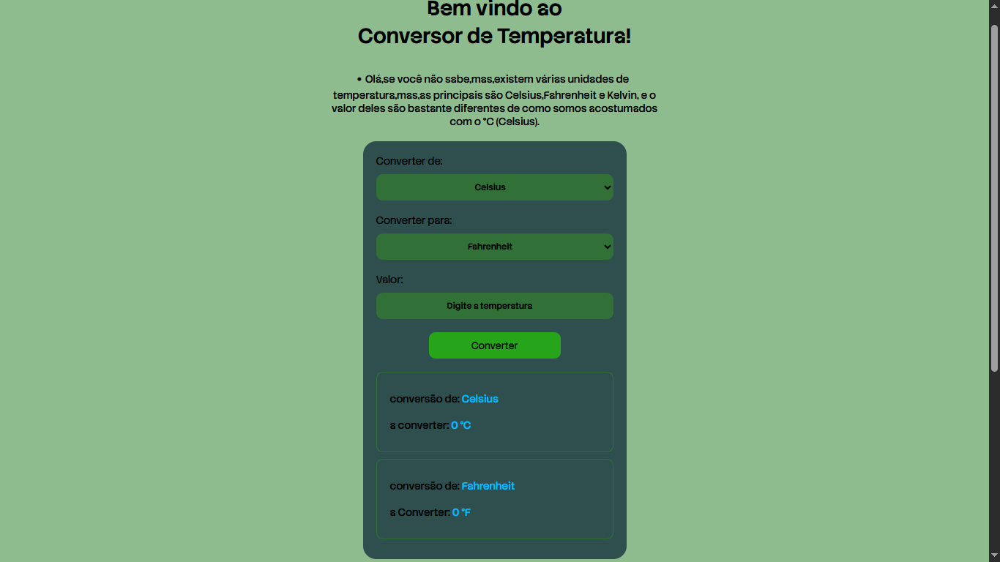
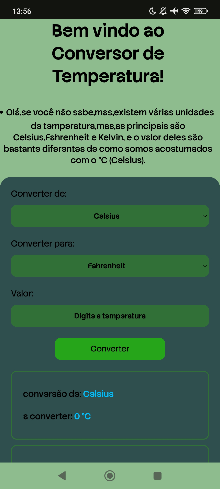

<h1 align="center">Conversor de Temperatura 🌡️</h1>

- Conversor simples de temperatura entre Celsius, Fahrenheit e Kelvin. Este projeto foi desenvolvido para praticar lógica de programação, manipulação de DOM e eventos utilizando HTML, CSS e JavaScript puro.

## Demonstração

👉 [Acesse o projeto online aqui](https://agdche.github.io/Conversor-de-Temperatura/)

## Funcionalidades 📋

- Conversão de valores entre Celsius, Fahrenheit e Kelvin
- Interface intuitiva e fácil de usar
- Resultado exibido automaticamente a cada alteração de valor ou unidade
  
## Como Rodar o Projeto 

1. Clone o repositório:
    ```bash
    git clone https://github.com/AGDCHE/Conversor-de-Temperatura.git
    
2.Acesse a pasta do projeto: cd Conversor-de-Temperatura.

3.Abra o arquivo index.html diretamente em seu navegador

## Tecnologias Utilizadas 👩‍💻
- HTML
- CSS
- JavaScript

## Como Funciona

- O usuário insere o valor da temperatura.
- Seleciona as unidades de origem e destino.
- Apertar no botão para converter o valor.
  
## Aprendizados 📚

- Prática de lógica condicional para múltiplas opções de conversão
- Manipulação de formulários e eventos com JavaScript
- Estruturação de um projeto front-end simples e organizado
  
## Melhorias Futuras 🌐

- Tornar o layout mais responsivo para dispositivos móveis

## Prints (Notebook vaio e android redmi note 13) 🖨️
<div align="center">
  
  
</div>
  
## Contato 📱

- Email: alerrandromiguel326@Gmail.com
- [Instagram](https://www.instagram.com/agdche/)
## Licença ©️

MIT
